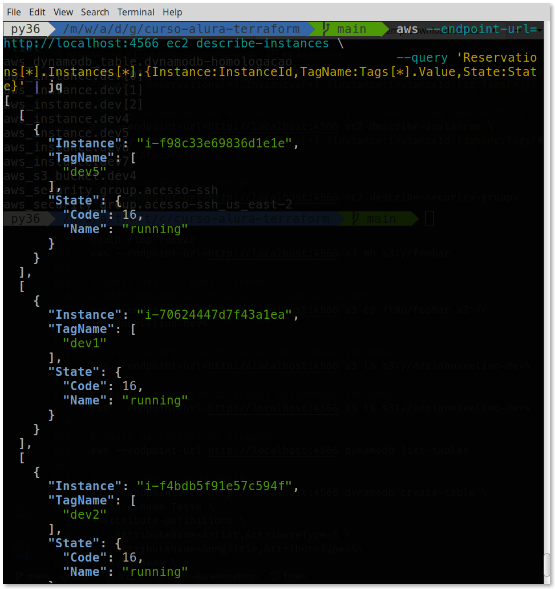

# curso-alura-terraform
<p>
    
    <a href="https://github.com/my-study-area">
        
    </a>
    
    <a href="https://github.com/my-study-area/curso-alura-terraform/commits/main">
    
    </a>
</p>

Curso de Terraform: Automatize a infraestrutura na nuvem



Curso desenvolvido utilizando Localstack para reproduzir os serviços da AWS. Dentre os recursos utilizados estão: EC2, S3 e DynamoDB
## Tecnologias
- Terraform
- Localstack (AWS)
- Docker e docker-compose 

## Passos para executar o projeto
```bash
# clona o projeto
git clone https://github.com/my-study-area/curso-alura-terraform.git

# entra no diretório do projeto
cd curso-alura-terraform

# inicia o localstack e o terraform
docker-compose up -d

# inicializa o diretório de trabalho com os arquivos de configuração
# do Terraform
terraform init

# cria ou atualiza a infraestrutura
terraform apply --auto-approve

# lista as instâncias ecs exibindo o id da instância, tag name e state
aws --endpoint-url=http://localhost:4566 ec2 describe-instances \
--query 'Reservations[*].Instances[*].{Instance:InstanceId,TagName:Tags[*].Value,State:State}'

# lista os security groups
aws --endpoint-url=http://localhost:4566 ec2 describe-security-groups

# verifica o bucket criado no localstack
aws s3api list-buckets --query "Buckets[].Name" \
--endpoint-url=http://localhost:4566
```
> Acesse [http://localhost:4566/health](http://localhost:4566/health) para visualizar os serviços disponíveis e a versão do localstack

> Caso necessite, é possível acessar o terraform via docker através do comando `docker-compose exec terraform sh`

> A execução dos comandos está disponível no Youtube, no canal [Diário de um dev](https://www.youtube.com/watch?v=P9n4ukcuk68)

## Instalação do terraform localmente
Após realizar o download do binário execute:
```bash
# descompacta o binário
unzip terraform_1.1.6_linux_amd64.zip

# adiciona permissão de execução e move para /usr/local/bin/
chmod +x terraform ; sudo mv terraform /usr/local/bin/

# verifica versão do terraform
terraform -version

# configura log do terraform para o terminal ativo
export TF_LOG=TRACE
export TF_LOG_path="terraform.txt"
```

## Anotações
```bash
# gera chave ssh com criptografia rsa
ssh-keygen -f terraform-aws -t rsa

# adiciona configuração aws para o profile localstack
aws configure --profile localstack

# lista as configurações do profile localstack
aws configure list --profile=localstack

# lista os profiles existentes
aws configure list-profiles

# prepara o diretório de traballho
terraform init

# reformata o arquivo .tf
terraform fmt

# osra as mudanças necessárias 
terraform plan

# cria ou atualia a infraestrutura
terraform apply

# destrói a infraestrutura criada
terraform destroy

# mostra a configuração atual
terraform show

# destrói o bucket e sua dependência
terraform destroy -target aws_s3_bucket.dev4

# verifica o bucket criado no localstack
aws s3api list-buckets --query "Buckets[].Name" \
--endpoint-url=http://localhost:4566

# lista as tags das instâncias ec2 
aws --endpoint-url=http://localhost:4566 ec2 describe-instances \
--query "Reservations[].Instances[].Tags[].Value"

# lista as instâncias ec2
aws --endpoint-url=http://localhost:4566 ec2 describe-instances \
--query 'Reservations[*].Instances[*].{Instance:InstanceId,Tag:Tags[*]}'

# lista as instâncias ecs exibindo o id da instância, tag name e state
aws --endpoint-url=http://localhost:4566 ec2 describe-instances \
--query 'Reservations[*].Instances[*].{Instance:InstanceId,TagName:Tags[*].Value,State:State}'

# lista os security groups
aws --endpoint-url=http://localhost:4566 ec2 describe-security-groups

# adiciona bucket foobar
touch /tmp/foobar
aws --endpoint-url=http://localhost:4566 s3 mb s3://foobar

# copia arquivo para o bucket
# onde adrianoavelino-dev4 é o nome do bucket
aws --endpoint-url=http://localhost:4566 s3 cp /tmp/foobar s3://adrianoavelino-dev4

# lista os arquivos do bucket adrianoavelino-dev4
aws --endpoint-url=http://localhost:4566 s3 ls s3://adrianoavelino-dev4

# delete um arquivo do bucket adrianoavelino-dev4
aws --endpoint-url=http://localhost:4566 s3 ls s3://adrianoavelino-dev4

# lista as tabelas no dynamodb
aws --endpoint-url http://localhost:4566 dynamodb list-tables 

# cria tabela no dynamodb
aws --endpoint-url http://localhost:4566 dynamodb create-table \
--table-name Teste \
--attribute-definitions \
    AttributeName=Artist,AttributeType=S \
    AttributeName=SongTitle,AttributeType=S\
--key-schema \
    AttributeName=Artist,KeyType=HASH \
    AttributeName=SongTitle,KeyType=RANGE \
--provisioned-throughput \
    ReadCapacityUnits=10,WriteCapacityUnits=5 \
--table-class STANDARD

# lista as regiões por nome e filtra por us
aws --endpoint-url=http://localhost:4566 \
ec2 describe-regions  --all-regions \
--query "Regions[].{Name:RegionName}" | grep us
```

## Links
- [Providers](https://registry.terraform.io/browse/providers)
- [AWS Providers](https://registry.terraform.io/providers/hashicorp/aws/latest/docs)
- [Security Group](https://registry.terraform.io/providers/hashicorp/aws/latest/docs/resources/security_group)
- [S3 bucket](https://registry.terraform.io/providers/hashicorp/aws/latest/docs/resources/s3_bucket)
- [DynamoDB](https://registry.terraform.io/providers/hashicorp/aws/latest/docs/resources/dynamodb_table)
- [DynamoDB Commands](https://docs.aws.amazon.com/cli/latest/reference/dynamodb/index.html)
- [Localstack Terraform](https://docs.localstack.cloud/integrations/terraform/)
- [Input Variable](https://www.terraform.io/language/values/variables#input-variables)
- [Backends Terraform](https://www.terraform.io/language/settings/backends)
- [CLI Configfile](https://www.terraform.io/cli/config/config-file)
